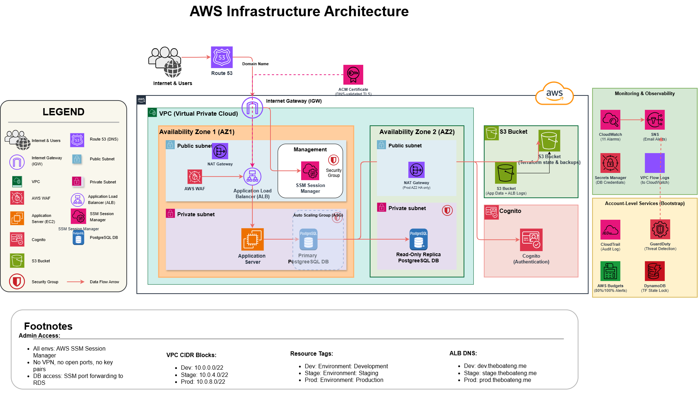

# Gabriel Infra — AWS Infrastructure with Terraform



This project builds a complete, production-ready web application infrastructure on AWS using Terraform. It creates three isolated environments — **dev**, **staging**, and **prod** — each with its own network, servers, database, firewall, VPN, authentication, and monitoring.

---

## What Gets Built

Every environment gets the following, fully automated:

| Component | What it does |
|-----------|-------------|
| **VPC (Virtual Private Cloud)** | A private network inside AWS, isolated from everyone else's resources |
| **ALB (Application Load Balancer)** | Receives HTTPS traffic from the internet and distributes it across your servers |
| **WAF (Web Application Firewall)** | Blocks malicious requests (SQL injection, known attack patterns, bots) before they reach your servers |
| **Auto Scaling Group** | Runs 1–6 EC2 servers depending on traffic — automatically adds more when busy, removes when idle |
| **SSM Session Manager** | Browser or CLI terminal on any EC2 instance — no open ports, no key pair required |
| **RDS PostgreSQL** | A managed database with one primary (read-write) and one replica (read-only) in different availability zones |
| **S3 Bucket** | File storage and ALB access log storage |
| **Cognito User Pool** | Handles user sign-up, sign-in, and authentication tokens for your application |
| **Route 53 DNS Records** | Automatically creates `dev.theboateng.me`, `stage.theboateng.me`, `prod.theboateng.me` |
| **ACM HTTPS Certificate** | Free TLS certificate, auto-validated via DNS |
| **CloudWatch Alarms** | 10 alarms covering CPU, memory, disk, unhealthy servers, replica lag, 5xx/4xx errors, and latency |
| **SNS Email Alerts** | Delivers alarm notifications to your email inbox |
| **Secrets Manager** | Stores database credentials securely — they never appear in config files or code |

At the account level (created once via Bootstrap):

| Component | What it does |
|-----------|-------------|
| **CloudTrail** | Records every API call made in your AWS account for auditing and forensics |
| **GuardDuty** | Continuously monitors for threats: compromised credentials, port scans, crypto mining, malware |
| **IAM Password Policy** | Enforces strong passwords for any IAM users |
| **Default EBS Encryption** | All new storage volumes are encrypted automatically |
| **AWS Budget Alert** | Emails you when spending reaches 80% or 100% of your monthly limit |

---

## Architecture Diagram

```
                         Internet
                            │
                            ▼
                        Route 53         (DNS: dev/stage/prod.theboateng.me → ALB)
                            │
                            ▼
                    Internet Gateway     (entry point into the VPC)
                            │
                            ▼
              WAF ─────► ALB (in 2 availability zones)
                            │
                    ┌───────┴───────┐
                    ▼               ▼
               EC2 Server      EC2 Server   (Auto Scaling Group)
                    │               │
                    └───────┬───────┘
                            │
                    ┌───────┴───────┐
                    ▼               ▼
              RDS Primary      RDS Replica  (PostgreSQL — different AZs)
              (read-write)     (read-only)

  Admin access (no open ports):
  Your Laptop ──► AWS SSM Session Manager ──► EC2 Servers (private IP, shell)
  Your Laptop ──► SSM Port Forwarding     ──► RDS (private IP, DB tunnel)
  Deployments ──► terraform apply (local)

  External services: Cognito (auth)   S3 (files + ALB logs)
  Account-wide:      CloudTrail   GuardDuty   Budget   IAM policy
```

**How the traffic flows:**
1. A user visits `https://prod.theboateng.me` (or `dev.theboateng.me`, `stage.theboateng.me`) → Route 53 resolves the name to the ALB's IP address
2. The request passes through WAF (malicious requests are blocked here)
3. The ALB terminates HTTPS, checks that a server is healthy, and forwards the request
4. Your application server handles the request, queries the RDS database if needed, and responds
5. Admin access uses SSM Session Manager (EC2 shell) or SSM port forwarding (database) — no ports open to the internet, no VPN required

---

## Environment Comparison

| | Dev | Staging | Prod |
|-|-----|---------|------|
| URL | `dev.theboateng.me` | `stage.theboateng.me` | `prod.theboateng.me` |
| VPC CIDR | 10.0.0.0/22 | 10.0.4.0/22 | 10.0.8.0/22 |
| App server | t3.small | t3.medium | t3.large |
| ASG (min/desired/max) | 1 / 1 / 2 | 2 / 2 / 4 | 2 / 2 / 6 |
| Database | db.t3.micro | db.t3.small | db.t3.medium |
| NAT Gateways | 1 (AZ1 only) | 1 (AZ1 only) | 2 (one per AZ — HA) |
| Elastic IPs | 1 | 1 | 2 |
| Admin access | SSM Session Manager | SSM Session Manager | SSM Session Manager |
| Deletion protection | Off | Off | On (ALB + RDS) |
| DB backups | 7 days | 7 days | 14 days + final snapshot |
| WAF rate limit | 2000 req/IP/5min | 2000 req/IP/5min | 1000 req/IP/5min |
| Cognito MFA | Off | Off | Optional |
| Monthly cost | ~$95 | ~$166 | ~$298 |

---

## Security Controls

| Control | Status |
|---------|--------|
| No SSH or admin ports open to internet — SSM only | ✓ |
| IMDSv2 required on all EC2 instances | ✓ |
| RDS encrypted at rest, not publicly accessible | ✓ |
| Secrets Manager for DB credentials (never in tfvars) | ✓ |
| S3 buckets — public access blocked, TLS-only | ✓ |
| S3 versioning enabled | ✓ |
| WAF with 5 managed/custom rules (OWASP, SQLi, IP reputation, rate limiting) | ✓ |
| ALB HTTPS-only (HTTP redirects to HTTPS) | ✓ |
| ALB TLS 1.3 cipher policy | ✓ |
| ALB access logs to S3 | ✓ |
| VPC flow logs | ✓ |
| Default EBS encryption account-wide | ✓ |
| CloudTrail multi-region with log file validation | ✓ |
| CloudTrail data events on Terraform state bucket | ✓ |
| GuardDuty with S3, malware, and runtime monitoring | ✓ |
| IAM strong password policy | ✓ |
| AWS Budget alerts | ✓ |
| Prod: deletion protection on ALB + RDS | ✓ |
| Prod: 14-day backups + final snapshot on destroy | ✓ |
| Prod: Cognito advanced security mode | ✓ |
| ALB SG egress scoped to app servers only | ✓ |
| RDS SG has no egress rule | ✓ |
| GuardDuty HIGH/CRITICAL findings → SNS email alert | ✓ |
| SSM port forwarding for DB access — no database port exposed | ✓ |

---

## Before You Start

**Read [REQUIREMENTS.md](REQUIREMENTS.md) from top to bottom before running any commands.**

It explains:
- How to create an AWS account and IAM user
- How to install the AWS CLI, Terraform, and git
- How to configure your domain name and DNS
- How to request Elastic IP quota increases (required for all three environments)
- Every file you need to edit before `terraform apply`

The short version of what you need installed and ready:

- [ ] AWS account with `AdministratorAccess` IAM user and access keys configured (`aws sts get-caller-identity` returns your account ID)
- [ ] Terraform >= 1.9.0 (`terraform version` works)
- [ ] A domain name you own and can change nameservers for
- [ ] AWS CLI configured and `aws sts get-caller-identity` returns your account ID

---

## Deployment Overview

Deployment happens in four stages. Full step-by-step instructions are in REQUIREMENTS.md.

```
Stage 1: Bootstrap (run once)
  └─ Creates: state S3 bucket, DynamoDB lock table, Route 53 zone,
              CloudTrail, GuardDuty, IAM policy, Budget

Stage 2: DNS setup (manual, ~15 min wait)
  └─ Copy the 4 nameservers from Bootstrap output to your domain registrar

Stage 3: Edit configuration files
  └─ Replace placeholders in backend.tf and terraform.tfvars files

Stage 4: Apply environments in order
  └─ dev → staging → prod
  └─ Verify each works before moving to the next
```

### Quick-start commands (after completing REQUIREMENTS.md)

```bash
# Stage 1 — Bootstrap
cd bootstrap
terraform init
terraform apply -var='budget_alert_emails=["you@example.com"]'
# → copy the outputs (route53_zone_id, state_bucket_name, name_servers)

# Stage 2 — Update nameservers at your domain registrar (manual step, then wait)

# Stage 3 — Edit files:
#   environments/*/backend.tf   → replace <ACCOUNT_ID> with your 12-digit account ID
#   environments/*/terraform.tfvars → fill in route53_zone_id, key_pair_name, alert_emails

# Stage 4 — Apply environments
cd environments/dev
terraform init && terraform plan && terraform apply

cd ../staging
terraform init && terraform plan && terraform apply

cd ../prod
terraform init && terraform plan && terraform apply
```

---

## Day-2 Operations

### Connect to an App Server (no SSH key needed)

AWS Systems Manager Session Manager lets you open a terminal on any EC2 instance without a key pair or open SSH port:

```bash
cd environments/dev    # or staging, prod

# Get the instance ID of the first instance in the ASG
INSTANCE=$(aws autoscaling describe-auto-scaling-groups \
  --auto-scaling-group-names $(terraform output -raw asg_name) \
  --query 'AutoScalingGroups[0].Instances[0].InstanceId' \
  --output text)

# Open a shell on that instance
aws ssm start-session --target $INSTANCE
```

### Retrieve Database Credentials

Database credentials are stored in AWS Secrets Manager and auto-generated — they are never in any config file.

```bash
cd environments/dev    # or staging, prod

aws secretsmanager get-secret-value \
  --secret-id $(terraform output -raw db_secret_arn) \
  --query SecretString \
  --output text
```

The output includes `host` (primary, read-write), `ro_host` (replica, read-only), `port`, `dbname`, `username`, and `password`.

### Connect to the Database via SSM Port Forwarding

SSM tunnels a local port on your laptop directly to the RDS private endpoint — no VPN, no open ports:

```bash
cd environments/dev

# Pick any running app instance as the tunnel host
INSTANCE=$(aws autoscaling describe-auto-scaling-groups \
  --auto-scaling-group-names $(terraform output -raw asg_name) \
  --query 'AutoScalingGroups[0].Instances[0].InstanceId' \
  --output text)

RDS_HOST=$(terraform output -raw db_primary_endpoint | cut -d: -f1)

# Open the tunnel (runs in foreground — keep this terminal open)
aws ssm start-session \
  --target $INSTANCE \
  --document-name AWS-StartPortForwardingSessionToRemoteHost \
  --parameters "host=$RDS_HOST,portNumber=5432,localPortNumber=5432"

# In a second terminal — connect as if RDS were local
psql "host=localhost port=5432 dbname=appdb user=dbadmin sslmode=require"
```

### View ALB Access Logs

```bash
cd environments/dev

aws s3 ls s3://$(terraform output -raw s3_bucket_name)/alb-dev/AWSLogs/
```

### Deploy a New Version of Your Application (Rolling Update)

The Auto Scaling Group performs a rolling replacement when the launch template changes. No downtime:

1. Update your `user_data.sh` or change `instance_type` in `modules/ec2_app/`
2. Run `terraform apply` from the environment directory
3. The ASG replaces instances one at a time, keeping at least 50% healthy throughout

### Deploy Your Application Code

After your infrastructure is running, deploy application code via SSM from your local machine:

```bash
cd environments/dev

ASG_NAME=$(terraform output -raw asg_name)

# Get all running instance IDs in the ASG
INSTANCES=$(aws autoscaling describe-auto-scaling-groups \
  --auto-scaling-group-names $ASG_NAME \
  --query "AutoScalingGroups[0].Instances[*].InstanceId" \
  --output text)

# Run your deploy script on every instance
for INSTANCE in $INSTANCES; do
  aws ssm send-command \
    --instance-ids $INSTANCE \
    --document-name "AWS-RunShellScript" \
    --parameters "commands=['cd /app && git pull && systemctl restart app']"
done
```

### Manually Trigger a CloudWatch Alarm Test

```bash
aws cloudwatch set-alarm-state \
  --alarm-name "insight-edge-dev-alb-5xx" \
  --state-value ALARM \
  --state-reason "Manual test" \
  --region us-east-1
```

This tests that SNS emails are reaching you. Reset it afterwards:

```bash
aws cloudwatch set-alarm-state \
  --alarm-name "insight-edge-dev-alb-5xx" \
  --state-value OK \
  --state-reason "Test complete"
```

---

## Module Reference

Each folder under `modules/` is a reusable component. Here is what each one does and the key decisions it makes:

### `modules/vpc`
Creates the network: VPC, 2 public subnets (ALB + VPN), 2 private subnets (servers + database), route tables, NAT gateways, VPC flow logs, and free S3/DynamoDB gateway endpoints (bypass NAT costs).

Prod uses `single_nat_gateway = false` to create a second NAT gateway in AZ2, so an AZ1 failure does not cut off AZ2's outbound internet access.

### `modules/security_groups`
Three security groups with least-privilege rules:
- **ALB SG**: accepts 80/443 from internet; can only send to app servers on `app_port`
- **App SG**: accepts `app_port` from ALB only; all admin access goes through SSM (no SSH port open)
- **RDS SG**: accepts 5432 from app servers only; no outbound rule; DB admin access uses SSM port forwarding

### `modules/alb`
Creates the load balancer, requests and validates an ACM HTTPS certificate, sets up an HTTP→HTTPS redirect, configures TLS 1.3 cipher policy, and enables access logging to S3.

### `modules/waf`
Attaches a WAFv2 Web ACL to the ALB with five rules in priority order:
1. AWS Common Rule Set (OWASP Top 10)
2. Known Bad Inputs (Log4Shell, Spring4Shell, etc.)
3. SQL injection protection
4. Amazon IP Reputation List (bots, threat-intel feeds)
5. Rate limiting (2000 req/5min in dev/staging, 1000 in prod) — blocks repeat offenders

### `modules/ec2_app`
Creates a launch template (Ubuntu 22.04, gp3 encrypted EBS, IMDSv2, CloudWatch agent) and an Auto Scaling Group across both private subnets. CPU target tracking scales the group at 70% average CPU. Rolling instance refresh (no downtime) triggers automatically when the launch template changes.

The IAM role gives instances SSM access (no SSH key needed), CloudWatch agent permission, and read-only access to Secrets Manager for `project/environment/*` paths.

### `modules/rds`
Creates a PostgreSQL 16 primary in AZ1 and a read replica in AZ2, both encrypted, not publicly accessible, with credentials stored in Secrets Manager. The parameter group enables connection logging and `pg_stat_statements`. Performance Insights is enabled in prod only.

### `modules/s3`
A single bucket serves two purposes: application file storage (under `backups/` for lifecycle management) and ALB access log storage (under `alb-{env}/`). Public access is fully blocked, and a bucket policy denies all non-TLS requests.

### `modules/cognito`
Creates a user pool (email sign-in, 12-character minimum password, SRP auth only, 1-hour token expiry, 30-day refresh tokens) and a Cognito domain at `{project_name}-{environment}.auth.{region}.amazoncognito.com`. Advanced security is enforced in prod.

### `modules/route53`
Creates two DNS records in the shared hosted zone: an alias record pointing `alb_dns_subdomain` to the ALB, and an A record pointing `vpn_dns_subdomain` to the VPN's Elastic IP.

### `modules/monitoring`
Creates an SNS topic with email subscriptions, then 11 CloudWatch alarms:

| Alarm | Triggers when |
|-------|--------------|
| `rds-cpu-high` | RDS CPU > 80% for 10 minutes |
| `rds-storage-low` | RDS free storage < 2 GB |
| `rds-replica-lag` | Replica > 60 seconds behind primary |
| `alb-5xx` | > 10 server errors in 5 minutes |
| `alb-unhealthy-hosts` | Any target group instance is unhealthy |
| `alb-latency-high` | p95 response time > 2 seconds |
| `alb-4xx` | > 50 client errors in 5 minutes |
| `asg-no-instances` | ASG has 0 in-service instances |
| `ec2-memory-high` | ASG average memory > 80% |
| `ec2-disk-high` | ASG average root disk > 80% |

---

## Cost Estimate (us-east-1, on-demand)

| Resource | Dev/mo | Staging/mo | Prod/mo |
|----------|-------:|----------:|--------:|
| ASG app instances | ~$15 | ~$60 | ~$120 |
| NAT Gateway(s) | ~$33 | ~$33 | ~$66 (2 gateways) |
| ALB | ~$17 | ~$17 | ~$17 |
| RDS primary + replica | ~$25 | ~$50 | ~$120 |
| S3 + ALB logs | ~$2 | ~$3 | ~$5 |
| CloudWatch + Alarms | ~$2 | ~$2 | ~$3 |
| Secrets Manager | ~$0.40 | ~$0.40 | ~$0.40 |
| **Per-env subtotal** | **~$95** | **~$166** | **~$331** |

Account-wide (once): CloudTrail ~$2/mo, GuardDuty ~$5/mo.

> Removing the VPN saves ~$8–15/month per environment and drops the total EIP count from 7 to 4 — all three environments run simultaneously within the default AWS quota of 5.

**Cost-saving tip:** Tear down dev and staging when not actively using them. `terraform destroy` takes ~10 minutes and you can re-apply later. NAT Gateways alone cost ~$33/month each even at zero traffic.

---

## Tear Down

Destroy in reverse order — environments first, Bootstrap last. Destroying Bootstrap while environments still exist orphans their state files.

```bash
# Prod — must disable deletion protection first (console or tf change)
cd environments/prod
terraform destroy

cd ../staging
terraform destroy

cd ../dev
terraform destroy

# Bootstrap last
cd ../../bootstrap
# NOTE: You must first remove the lifecycle { prevent_destroy = true } block
# from aws_s3_bucket.terraform_state AND aws_dynamodb_table.terraform_locks
# in bootstrap/main.tf before this will succeed.
terraform destroy
```

---

## Known Intentional Simplifications

These were deliberately excluded to keep the complexity proportional to the architecture diagram. Add them if you need them:

- **CloudFront** in front of the ALB — adds edge caching and Shield Advanced integration
- **Secrets Manager rotation Lambda** — automatically rotates the database password on a schedule
- **AWS Config + Conformance Packs** — continuous compliance checking against CIS or PCI standards
- **VPC Interface Endpoints** (SSM, Secrets Manager, EC2 Messages) — fully private AWS API calls, no NAT traffic
- **KMS Customer-Managed Keys** — stronger key isolation than the default AWS-managed keys
- **RDS IAM Authentication** — passwordless database connections via IAM role
- **GitHub OIDC Provider** — if you later add CI/CD pipelines, add this to bootstrap
- **Multi-region disaster recovery** — replicates prod to a second region
- **Amazon SES for Cognito** — production email volume (default Cognito email caps at 50/day)

---

## Repository Layout

```
.
├── README.md                  This file
├── REQUIREMENTS.md            Step-by-step setup guide (start here)
├── bootstrap/
│   ├── main.tf                State bucket, Route 53, CloudTrail, GuardDuty, Budget
│   ├── variables.tf
│   └── outputs.tf
├── modules/
│   ├── vpc/
│   ├── security_groups/
│   ├── alb/
│   ├── waf/
│   ├── ec2_app/
│   ├── vpn/
│   ├── rds/
│   ├── s3/
│   ├── cognito/
│   ├── route53/
│   └── monitoring/
└── environments/
    ├── dev/
    │   ├── main.tf            Wires all modules together for dev
    │   ├── variables.tf
    │   ├── terraform.tfvars   ← Edit this before applying
    │   ├── backend.tf         ← Edit this (replace <ACCOUNT_ID>)
    │   └── outputs.tf
    ├── staging/               (same structure as dev)
    └── prod/                  (same structure, with prod-specific hardening)
```
